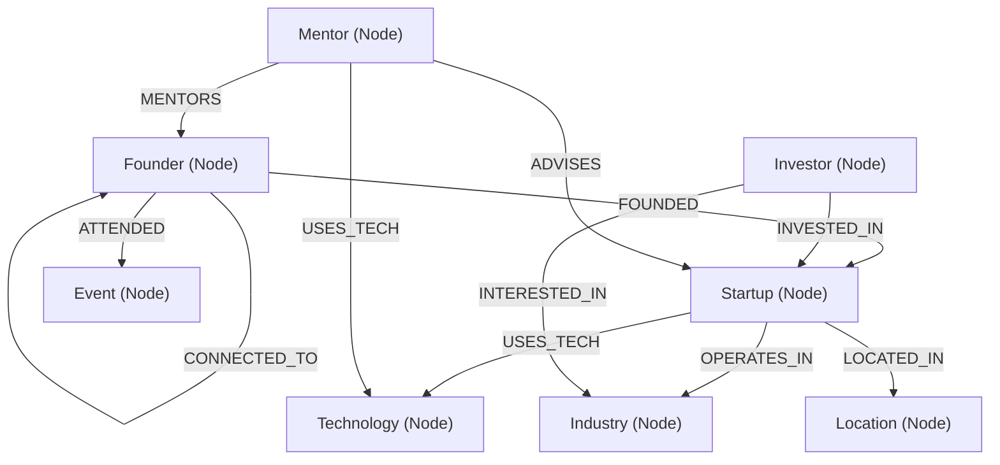

# ConnectSphere — Graph-Powered Investor SaaS & Networking Platform

---

## 🌟 Executive Summary & Use Case

**ConnectSphere** is an investor-grade SaaS startup networking and graph intelligence platform. It maps real-time relationship topologies between **Founders, Startups, Investors, Mentors, Technologies, Industries, Locations, and Events**.

Traditional relational platforms struggle to answer complex relationship questions—such as *"Which investors focus on industries related to startups using my tech stack?"* or *"What is the shortest path of mutual connections between two founders?"*. ConnectSphere solves this by leveraging a graph database topology, delivering instant multi-hop traversals and graph-powered recommendation algorithms.

---

## ❓ Why a Graph Database?

Relational databases (SQL) store entities in disconnected tables, requiring complex, expensive multi-table `JOIN` operations when querying multi-degree relationships. As query depth increases (2+ hops), SQL performance degrades exponentially.

### Graph Database Advantages in ConnectSphere:
1. **Multi-Hop Traversal Performance**: Navigating from a `Founder` to their `Startup`, to its `Technology` stack, to a `Mentor` possessing expertise in that technology (`(Founder)-[:FOUNDED]->(Startup)-[:USES_TECH]->(Technology)<-[:USES_TECH]-(Mentor)`) is a constant-time pointer hop in CognoDB, avoiding heavy SQL `JOIN`s.
2. **Native Shortest Path Calculation**: Finding the shortest connection path between two founders (`shortestPath((f1)-[*..6]-(f2))`) is built into openCypher algorithms without writing recursive CTEs.
3. **Flexible Schema Evolution**: Graph schemas naturally adapt to new node types (e.g. adding `Location` or `Event`) without disruptive SQL table migrations or foreign key locks.
4. **Pattern Matching & Recommendation Intelligence**: Cypher graph pattern matching allows effortless discovery of friend-of-friend mutual connections and Jaccard technology stack similarities.

---

## 📊 Graph Data Model



### Nodes (8 Labels):
- `Founder`: `{ id, name, title, startupId, startupName, bio, skills, location, connectionCount }`
- `Startup`: `{ id, name, pitch, industry, fundingStage, teamSize, valuation, totalFunding, techStack }`
- `Investor`: `{ id, name, firm, role, focusIndustries, ticketSize, portfolioCount }`
- `Mentor`: `{ id, name, title, company, expertise, technologies, availability, rating }`
- `Technology`: `{ id, name, category, adoptionTrend, startupCount }`
- `Industry`: `{ id, name, startupCount, totalFunding, growthRate }`
- `Location`: `{ id, name, country, startupDensity }`
- `Event`: `{ id, name, date, location, attendeesCount }`

---

## 💻 Engineering Architecture

Startup Nexus follows a strict **Clean Layered Architecture**:

```
src/
├── app/
│   ├── api/                     # 23 App Router REST API Endpoints
│   │   ├── dashboard/           # Live statistics & stream feed
│   │   ├── founders/            # Founders CRUD & details
│   │   ├── startups/            # Startups CRUD & details
│   │   ├── investors/           # Investors directory
│   │   ├── mentors/             # Mentors directory
│   │   ├── technologies/        # Technologies graph
│   │   ├── industries/          # Industries sectors
│   │   ├── graph/               # 2D graph topology & depth traversal
│   │   ├── search/              # Global search endpoint
│   │   ├── seed/                # Seeding route handler
│   │   └── recommendations/     # Multi-hop recommendation engine
│   ├── page.tsx                 # SSR Dashboard Page
│   ├── founders/page.tsx        # SSR Founders Page
│   ├── startups/page.tsx        # SSR Startups Page
│   ├── investors/page.tsx       # SSR Investors Page
│   ├── mentors/page.tsx         # SSR Mentors Page
│   ├── technologies/page.tsx    # SSR Technologies Page
│   ├── industries/page.tsx      # SSR Industries Page
│   ├── recommendations/page.tsx # SSR Recommendations Page
│   └── graph-explorer/page.tsx  # SSR Graph Explorer Page
├── components/
│   ├── client/                  # Interactive Client Islands ('use client')
│   ├── layout/                  # AppShell, Header, Sidebar
│   └── ui/                      # Card, StatCard, Badge, SearchModal, ProfileDrawer
├── hooks/                       # Custom data fetching React hooks (useEcosystem.ts)
├── store/                       # Zustand client state stores (useEcosystemStore, useGraphStore)
├── types/                       # Shared TypeScript interfaces & types
└── lib/
    ├── cognodb.ts               # Driver singleton & safe session execution
    ├── env.ts                   # Environment variables validator
    ├── errors.ts                # Centralized API error handling
    ├── logger.ts                # Application logging service
    ├── seed.ts                  # Idempotent database seeder script
    ├── queries/                 # Parameterized Cypher queries
    ├── repositories/            # Data access repositories with fallbacks
    └── services/                # Business logic services
```

---

## ⚡ Main Cypher Queries Explained

All Cypher queries use **parameterized variables** (`$founderId`, `$startupId`, `$limit`) to prevent injection and optimize query plan caching.

### 1. Recommend Investors for a Founder (2-Hop Traversal)
Discovers investors who focus on industries corresponding to a founder's startup:
```cypher
MATCH (f:Founder {id: $founderId})-[:FOUNDED]->(s:Startup)-[:OPERATES_IN|IN_INDUSTRY]->(ind:Industry)
MATCH (inv:Investor)-[:INTERESTED_IN|INVESTED_IN]->(ind)
WHERE NOT (inv)-[:INVESTED_IN]->(s)
RETURN inv, count(ind) AS score, collect(DISTINCT ind.name) as matchedIndustries
ORDER BY score DESC
LIMIT toInteger($limit);
```

### 2. Recommend Mentors by Shared Technology Stack
Matches mentors who possess hands-on expertise in a startup's tech stack:
```cypher
MATCH (f:Founder {id: $founderId})-[:FOUNDED]->(s:Startup)-[:USES_TECH]->(t:Technology)
MATCH (m:Mentor) WHERE (m)-[:USES_TECH]->(t) OR t.name IN m.technologies
RETURN m, count(t) AS score, collect(DISTINCT t.name) as sharedTechnologies
ORDER BY score DESC
LIMIT toInteger($limit);
```

### 3. Mutual Founder Connections (Friend-of-Friend Pattern)
Identifies unlinked founders sharing mutual connections:
```cypher
MATCH (f1:Founder {id: $founderId})-[:CONNECTED_TO]-(mutual:Founder)-[:CONNECTED_TO]-(f2:Founder)
WHERE f1 <> f2 AND NOT (f1)-[:CONNECTED_TO]-(f2)
RETURN f2, count(mutual) AS mutualCount, collect(DISTINCT mutual.name) AS mutualNames
ORDER BY mutualCount DESC
LIMIT toInteger($limit);
```

### 4. Shortest Path Between Two Founders
Calculates the exact relationship path between two ecosystem founders:
```cypher
MATCH (f1:Founder {id: $fromFounderId}), (f2:Founder {id: $toFounderId})
MATCH p = shortestPath((f1)-[:CONNECTED_TO|FOUNDED|INVESTED_IN|MENTORS|USES_TECH*..6]-(f2))
RETURN [node IN nodes(p) | { id: node.id, label: coalesce(node.name, node.label, node.id), type: labels(node)[0] }] AS nodes,
       [rel IN relationships(p) | { type: type(rel), source: startNode(rel).id, target: endNode(rel).id }] AS relationships,
       length(p) AS pathLength;
```

---

## 🛠️ Setup & Local Running Instructions

### 1. Provision CognoDB Instance
1. Sign up for a free account at [https://console.cognodb.com/signup](https://console.cognodb.com/signup).
2. Create a free (c0) instance in your preferred region.
3. Note your connection credentials:
   - **URI**: `bolt+s://<instance-id>.databases.cognodb.cloud`
   - **Username**: `cognodb` (or `neo4j`)
   - **Password**: Your generated instance password.

### 2. Configure Environment Variables
Copy `.env.example` to `.env.local`:
```bash
cp .env.example .env.local
```

Set your CognoDB credentials in `.env.local`:
```env
COGNODB_URI=bolt+s://your-instance-id.databases.cognodb.cloud
COGNODB_USERNAME=cognodb
COGNODB_PASSWORD=your-generated-password
```

### 3. Install Dependencies
```bash
npm install
```

### 4. Seed the Database
Run the idempotent seed script to populate 8 node labels and 11 relationship types:
```bash
npm run seed
```
*(Alternatively, send a `POST` request to `http://localhost:3000/api/seed` when the app is running).*

### 5. Start Development Server
```bash
npm run dev
```
Open [http://localhost:3000](http://localhost:3000) in your browser.

---

## 📮 Submission Details

- **Deliverable**: GitHub Repository containing full source code, seed scripts, Cypher queries, and documentation.
- **Recipient**: `hr@wexa.ai`
- **Subject Line**: `Build a Graph Database Application Assignment [Tushar Revankar]`
